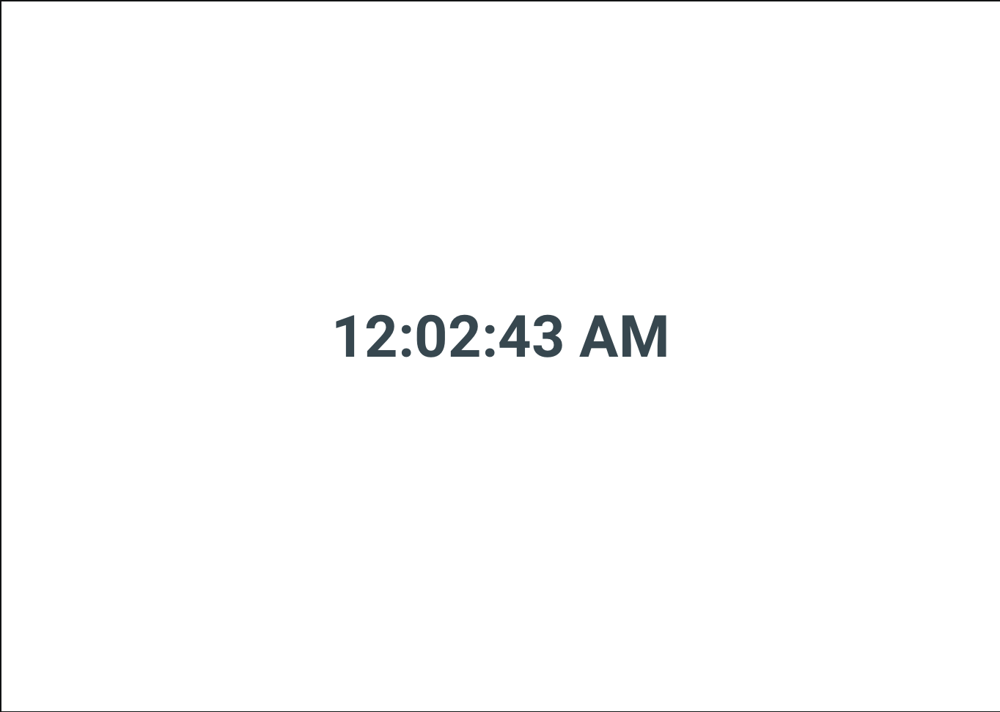

# Exercise 1



## Requirements

1. Create a React App using **TYPESCRIPT**.
1. The app has only one page.
1. The page shows current time in format HH:MM:SS AM/PM
1. The styling of the text must match the following.
1. Write a Snapshot test using **jest**.

```
font-family: Roboto-Bold;
font-size: 84px;
color: #37474F;
```

## Restrictions

1. **You cannot use Create React App (CRA).**
1. The app must be created from scratch. You can reference CRA and take hints from it.
1. **Use minimum number of 3rd party libraries.**
1. Use React 16 or 17.
1. Use latest Typescript version.
1. You cannot use `any` in Typescript.
1. All props and components must be properly typed.