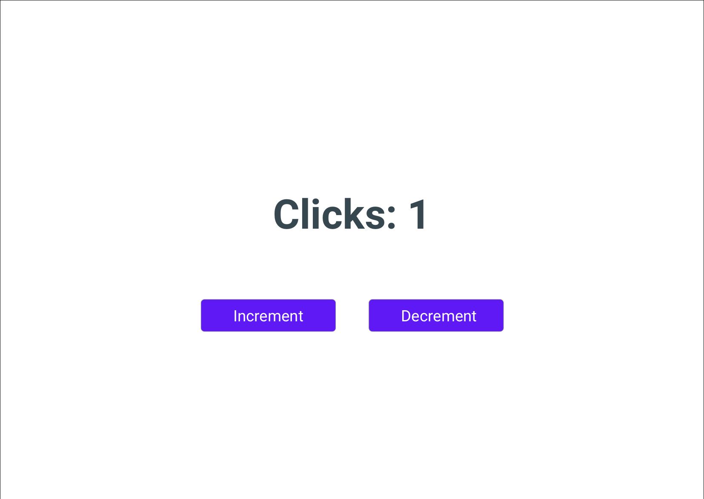

# Exercise 1



## Requirements

1. Create a React App using **TYPESCRIPT**.
1. The app has only one page.
1. The page shows number of clicks.
1. There are two buttons. Increment and Decrement
1. Increment adds 1 to clicks.
1. Decrement subtracts 1 from clicks.
1. Track the number of clicks using **[MobX](https://mobx.js.org/README.html)** .
1. The styling of the text must match the following.
1. Write a Snapshot test using **jest**.
1. Write a **Unit Test** for your mobx store using **jest**.

### Clicks CSS

```
font-family: Roboto-Bold;
font-size: 84px;
color: #37474F;
```

### Button CSS

```
background: #5E19F5;
border: 1px solid #979797;
border-radius: 8px;
font-family: Roboto-Regular;
font-size: 32px;
color: #FFFFFF;
```

## Restrictions

1. **You cannot use Create React App (CRA).**
1. The app must be created from scratch. You can reference CRA and take hints from it.
1. The clicks must be tracked using **[MOBX](https://mobx.js.org/README.html)**
1. **Use minimum number of 3rd party libraries.**
1. Use React 16 or 17.
1. Use latest Typescript version.
1. You cannot use `any` in Typescript.
1. All props and components must be properly typed.
