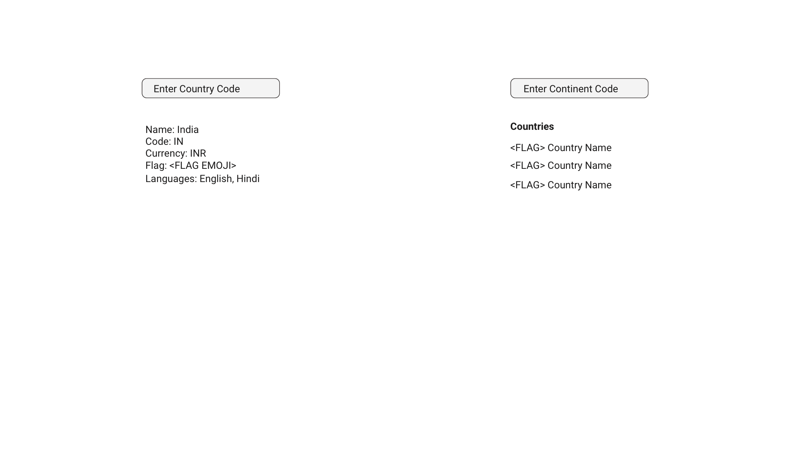

# Exercise 1

## Goal
Focus on how you can isolate the side effects from React Components.

## Requirements

1. Create a React App using **TYPESCRIPT**.
1. The app has only one page.
1. There are two sections in the page
1. The left section takes a **Country Code** as input from user.
1. The left section shows country information as output.
1. The right section takes a **Continent Code** as input from user.
1. The right section shows list of countries and their flags as output.
1. Use (Apollo Client)[https://www.apollographql.com/docs/react/] to fetch data.
1. (Use this API to fetch data)[https://github.com/trevorblades/countries]
1. You must display the flag emoji (the api returns it).
1. Write unit tests for your business logic using **jest**.
1. Write a Snapshot test using **jest**.

## CSS

Show off your CSS skills and make is as beautiful as you can.

## Restrictions

1. **You cannot use Create React App (CRA).**
1. The app must be created from scratch. You can reference CRA and take hints from it.
1. Data must be fetched using (Apollo Client)[https://www.apollographql.com/docs/react/].
1. **Use minimum number of 3rd party libraries.**
1. Use React 16 or 17.
1. Use latest Typescript version.
1. You cannot use `any` in Typescript.
1. All props and components must be properly typed.
